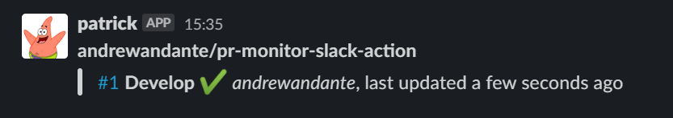

# Pull Request Monitor + Slack Github Action



## What is this? Why is it useful?

It checks your repo for open pull requests, then sends a message to your designated
Slack channel with the details.

It can be used as a kind of stand-up - a reminder of PRs that need reviewing, a way
to see if there are stale PRs we can purge, merge or refactor.

## Setup

### Slack

You'll need an app and a bot user configured to do the posting for you. Visit 
[Slack's documentation](https://api.slack.com/bot-users#creating-bot-user) 
to learn how to create an App and how to create the bot user. 

#### Permissions

Visit the "OAuth & Permissions" section on your App's settings page to configure 
these - it will need the following permissions at a minimum:

- `channels:join`
- `chat:write`
- `incoming-webhook`

Once configured, add the App to your workspace - this will generate an Oauth token
(same page as above) - you'll need this later. You then need to invite it the
bot to the channel that you plan to send messages to.

### Github

Add the following to a file called something like `pr-monitor.yml` to your `.github/workflows` directory:

```yaml
on:
  schedule:
    # 9:25 am Mon-Fri, just in time for stand up
    - cron:  '25 9 * * 1-5' 

jobs:
  pr-monitor-job:
    runs-on: ubuntu-latest
    name: PR monitor
    steps:
      - name: Checkout
        uses: actions/checkout@v2
      - name: Scan for PRs
        id: scan
        uses: @actions/pr-monitor-slack-action
        with:
          # required inputs
          slack-token: ${{ secrets.SLACK_OAUTH_TOKEN }}
          github-token: ${{ secrets.GITHUB_TOKEN }}
          # optional inputs (with defaults set)
          channel: '#pr-monitor'
          sort: 'updated'
          sort-direction: 'desc'
          approved-emoji: 'heavy_check_mark'
          pending-emoji: 'heavy_minus_sign'
          changes-requested-emoji: 'x'
          requested-reviewer-emoji: 'heavy_minus_sign'
```

#### Inputs

##### slack-token [required]

Oauth token of the App, used to authenticate the bot user so the message can be
posted. Here, you should save the Oauth token (should start with `xoxb-`) as a
secret on the repo - I've called it `SLACK_OAUTH_TOKEN` in the example.

##### github-token [required]

Used to authenticate the Github API, as we are looping through reviewers and pull
requests and such. `secrets.GITHUB_TOKEN` is defined by default, so you should
just use that.

##### channel [default: '#pr-monitor'] 

The channel to post to in Slack. Make sure the bot user is invited!

##### sort [default: 'updated']

What field the pull requests are sorted on when retrieved. See 
(the Octokit docs)[https://octokit.github.io/rest.js/#octokit-routes-pulls-list]
for further explanation. Valid values are 'created', 'updated', 'popularity'
or 'long-running'

##### sort-direction [default: 'desc']

The order of the sort. Can also be 'asc'.

##### approved-emoji [default: 'heavy_check_mark']

The emoji to use for a pull request review that has approved the changes
(minus the wrapping colons)

##### pending-emoji [default: 'heavy_minus_sign']

The emoji to use for a pull request review that is pending (minus the 
wrapping colons)

##### changes-requested-emoji [default: 'x']

The emoji to use for a pull request review that has requested changes (minus
the wrapping colons)

##### requested-reviewer-emoji [default: 'heavy_minus_sign']

The emoji to use for a pull request review has been requested but not begun
(minus the wrapping colons)

## Thanks

Shout out to [stojg/purr](https://github.com/stojg/purr), the first iteration of
this idea that motivated me enough to learn Javascript just to write it.
